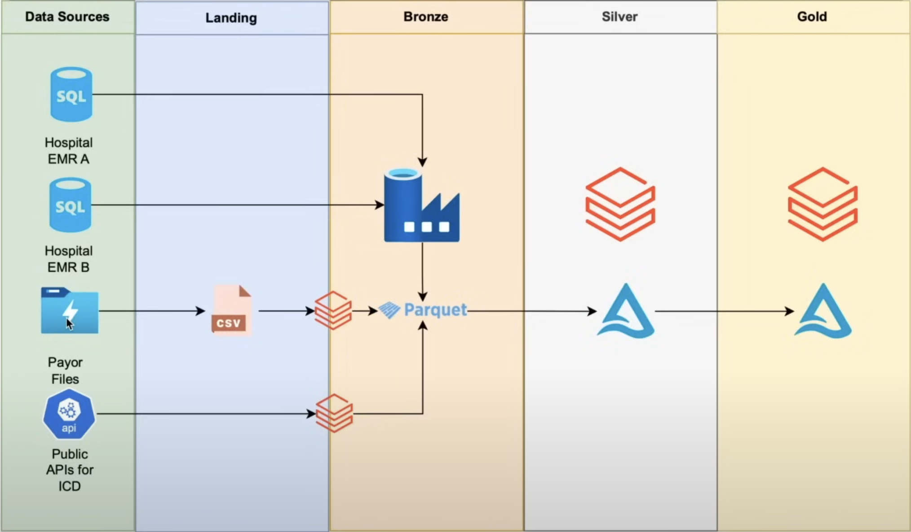
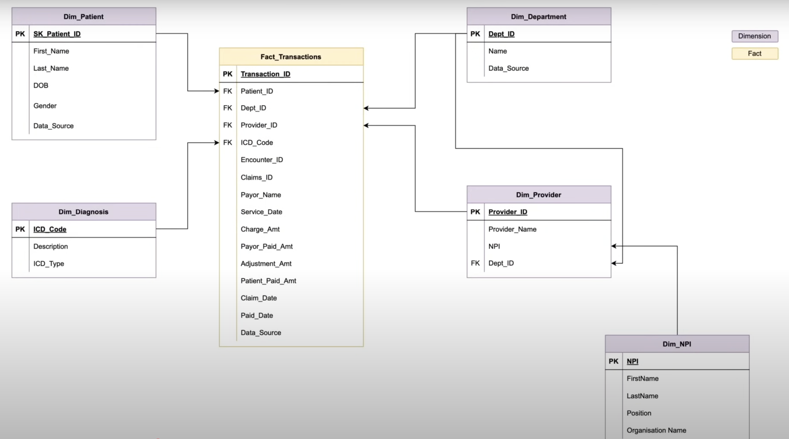

---
# RCM Healthcare Data Pipeline Project

  
[](https:https://jitendrabhamare.github.io/rcm-healthcare-project/#/)


Welcome to the **RCM Healthcare Data Pipeline Project**!

This repository contains an end-to-end data pipeline for processing Revenue Cycle Management (RCM) data from two fictional hospitals, transforming raw hospital records into actionable financial insights. Built using Microsoft Azure tools—Data Factory, Databricks, ADLS Gen2, SQL Database, Key Vault, and Unity Catalog—this project follows a **Medallion architecture** (Bronze → Silver → Gold) to automate data ingestion, cleaning, historization, and reporting.

Whether you are a Backend Software Engineer, a Data Engineer exploring Azure-based data pipelines, or a Healthcare Analyst working with RCM data, this project offers a comprehensive framework that can be leveraged for learning and adaptation.

---

## Table of Contents

- [Overview](#overview)
- [Key Features](#key-features)
- [Achievements & Improvements](#achievements--improvements)
- [Data Sources](#data-sources)
- [Pipeline Steps & Flow](#pipeline-steps--flow)
- [End-User Access & Consumption](#end-user-access--consumption)
- [Key Learnings](#key-learnings)
- [Project Structure](#project-structure)
- [Contributing](#contributing)
- [License](#license)
- [Contact](#contact)

---

## Overview

The pipeline consists of two main stages:

1. **Ingestion to Bronze (Raw Data Layer)**  
   - Extracts raw Electronic Medical Records (EMR) data from Azure SQL Databases  
   - Loads it into Azure Data Lake Storage Gen2 (ADLS Gen2) Bronze layer as Parquet files  
   - Uses metadata-driven Azure Data Factory (ADF) pipelines for automation  

2. **Transformation to Silver & Gold (Processed & Business-ready Data)**  
   - Cleans and historizes data in Databricks (Silver Layer)  
   - Creates business-ready Fact and Dimension tables in Delta format (Gold Layer)  

The outcome is a **scalable**, **secure**, and **fully automated data pipeline** that transforms raw, unstructured hospital data into clean, historized tables optimized for financial reporting—all documented within this repository.


## Key Features

- **Metadata-Driven Pipelines** – A single configuration file (`load_config.csv`) orchestrates data ingestion for 10 tables, supporting:  
  - **Full** loads for static data (e.g., `departments`).  
  - **Incremental** loads for dynamic data (e.g., `encounters`).  
- **Medallion Architecture** – Implements a layered data flow:  
  - Bronze (Raw data storage in ADLS Gen2).  
  - Silver (Cleansed and historized data).  
  - Gold (Business-ready analytics layer).  
- **Dual Transformation Logic** – Supports two data update strategies:  
  - **Full Refresh** – Replaces static Silver tables (e.g., `departments`) entirely.  
  - **Slowly Changing Dimension Type 2 (SCD2)** – Tracks history in dynamic tables like `patients`—preserves past records (e.g., old addresses) with `is_current` flags.  
- **Delta Tables** – Silver and Gold layers utilize Delta format, enabling:  
  - ACID transactions for data integrity.  
  - Versioning & rollback capabilities for auditing and recovery.  
- **Enhanced Security with Key Vault** – Stores sensitive credentials (e.g., SQL passwords) securely in Azure Key Vault, preventing hardcoding.  
- **Centralized Governance with Unity Catalog** – Centralizes table management in Databricks—organized and governed.  

<!--  -->

## Achievements & Improvements

- **Scalability** – A single pipeline processes 10 tables using `load_config.csv`. Adding a new table requires only a config update—no code changes needed.  
- **Performance Optimization** – Parallelized `pl_emr_src_to_landing` (batch count: 5), reducing ingestion time for large datasets.  
- **Enhanced Flexibility** – Introduced an `is_active` flag in the config file, allowing tables to be skipped without modifying the pipeline code.  
- **Security Upgrade** – Eliminated hardcoded credentials, migrating to Azure Key Vault for a production-ready, secure, and leak-proof implementation.  
- **Improved Efficiency** – Mounted ADLS containers in Databricks, enabling faster access and cleaner code.  

These enhancements transformed a prototype into a scalable, secure, and efficient system, ready to handle real-world RCM challenges.

<!--  -->

## Data Sources

This pipeline processes data from **three primary sources**, each ingested into the system based on its format and update frequency.

### **1. Electronic Medical Records (EMR)**  
- **Source:** SQL Databases  
- **Data:** Patient demographics, encounters, transactions, departments, insurance providers  
- **Update Frequency:** Continuous  
- **Storage:** Directly loaded into the **Bronze Layer (Parquet format)**  

### **2. Claims Data**  
- **Source:** Flat files (CSV)  
- **Data:** Monthly insurance claims submitted by hospitals  
- **Update Frequency:** Monthly  
- **Storage:** Initially stored in the **Landing Layer (CSV format)** before ingestion into Bronze  

### **3. Code Mappings (NPI & ICD Codes)**  
- **Source:** Public APIs  
- **Data:**  
  - **National Provider Identifier (NPI):** Unique IDs assigned to healthcare providers  
  - **ICD Codes:** Standardized diagnostic codes  
- **Update Frequency:** As per API availability  
- **Storage:** Directly loaded into the **Bronze Layer (Parquet format)**  

---


## **Pipeline Steps & Flow**

This pipeline follows a **Medallion Architecture** (Landing → Bronze → Silver → Gold), progressively refining raw hospital RCM data into **business-ready insights**. Each stage builds upon the last, handling **multiple data sources (EMR databases, claims CSVs, APIs)** through **ingestion, transformation, and aggregation**. The architecture ensures **scalability, data quality, historization, and optimized performance** for downstream analytics.



---

### **1. Data Ingestion (Landing → Bronze Layer)**

- **Format:** Parquet  
- **Objective:** Standardize raw data ingestion for structured storage.  

#### **Sources & Processing Logic:**

1. **EMR Data Extraction**  
   - Extracts **Electronic Medical Records (EMR)** from hospital databases.  
   - Supports **full** (entire dataset) and **incremental** (only new/modified records) loads.  
   - Data stored in the **Bronze Layer (Parquet format)**, maintaining raw structure for historical tracking.  

2. **Claims Data Ingestion**  
   - Insurance claims data arrives as **CSV files** in the **Landing Layer**.  
   - Converted to **Parquet format** in the **Bronze Layer**, optimizing for efficient storage and querying.  

3. **NPI & ICD Code Fetching**  
   - Public APIs provide **provider (NPI) and diagnosis (ICD) codes**.  
   - Data is fetched programmatically and stored in the **Bronze Layer** for downstream enrichment.  

#### **Why Parquet?**
- **Columnar storage** improves query speed.  
- **Compression (Snappy, Gzip)** reduces storage footprint.  
- **Schema evolution support** ensures flexibility.  

---

### **2. Data Transformation (Bronze → Silver Layer)**

- **Format:** Delta Tables  
- **Objective:** Clean, unify, and historize data while maintaining integrity.  

#### **Processing Logic:**

1. **Data Cleaning & Standardization**  
   - Schema unification (e.g., `PatientID` from different hospitals mapped to `SRC_PatientID`).  
   - Deduplication and null handling (e.g., flagging missing critical fields).  

2. **Full Refresh for Static Tables**  
   - Example: **Department Listings**  
   - Merges data from multiple sources, ensuring a **current** and **de-duplicated** view.  

3. **Slowly Changing Dimensions Type 2 (SCD2) for Dynamic Tables**  
   - Example: **Patient Data**  
   - Tracks historical changes (e.g., address updates).  
   - Ensures previous records remain available while marking the latest as `is_current = true`.  

#### **Why Delta?**
- **ACID Transactions** ensure consistency in merges and updates.  
- **Versioning** allows rollback to previous states if needed.  
- **Optimized for high-performance transformations** in a structured lakehouse environment.  

---



### **3. Data Aggregation (Silver → Gold Layer)**

- **Format:** Delta Tables  
- **Objective:** Create **business-ready, analytics-friendly** data.  

#### **Processing Logic:**

1. **Fact Table Creation (`gld_transactions`)**  
   - Aggregates **claims and payment** data.  
   - Ensures only **valid and active records** contribute to KPIs.  

2. **Dimension Table Creation (`gld_patients`)**  
   - Stores **historized patient details**, ensuring **only the latest, valid data** is included.  

3. **Filtering & Quality Checks**  
   - `is_current = true` ensures only the latest active records are used.  
   - `is_quarantined = false` removes incomplete or invalid data.  

#### **Why Gold?**
- Business-friendly format for **executives, analysts, and dashboards**.  
- Aggregated KPIs like **Days in Accounts Receivable (AR)**.  
- Simplifies **reporting and visualization** without the complexity of raw transactional data.  

---

### **4. End-to-End Data Flow**

Below is a **high-level overview** of the pipeline’s data movement:

```plaintext
SQL DBs / APIs / CSVs  
       │  
       ▼  
Landing Layer (Raw Claims Data - CSV)  
       │  
       ▼  
Bronze Layer (Parquet - Unstructured, Source of Truth)  
       │  
       ▼  
Silver Layer (Delta Tables - Cleaned, Standardized, Historized)  
       │  
       ▼  
Gold Layer (Delta Tables - Aggregated, Business-Ready)
```

---

## **End-User Access & Consumption**

| **Layer**  | **Primary Users**                  | **Use Cases**                                      |
|------------|------------------------------------|----------------------------------------------------|
| **Bronze** | **Data Engineers**                 | Raw data ingestion, debugging, lineage tracking   |
| **Silver** | **Data Scientists, ML Experts, Analysts** | Machine learning models, advanced analytics, trends |
| **Gold**   | **Business Users**                 | Financial reporting, operational analytics, dashboards |

---

## Key Learnings

- **Metadata Magic**: `load_config.csv` made pipelines scalable—10 tables, one setup—automation at its best.  
- **Full vs. SCD2**: Full Refresh is simple for static data; SCD2’s complexity pays off for history (e.g., patient moves).  
- **Delta Power**: Delta tables brought reliability—ACID and versioning beat Parquet’s static limits.  
- **Security Matters**: Key Vault turned a prototype secure—essential for production DE.  
- **Troubleshooting**: Fixed errors (e.g., SQL timeouts)—DE’s half coding, half detective work.  
- **Real-World Ready**: Parallel runs, mounts, and flags prepped this for scale—learned by doing!  

## Project Structure

This repository is organized into the following directories and files:

- `/1. Set up/`  
  - **Description:** Contains resources and scripts necessary for the initial setup of the project environment.  
  - **Purpose:** Facilitates the configuration of infrastructure and services required for the data pipeline.  

- `/2. API extracts/`  
  - **Description:** Includes scripts and configurations for extracting data from various APIs.  
  - **Purpose:** Automates the retrieval of external data sources to be integrated into the data pipeline.  

- `/3. Silver/`  
  - **Description:** Holds scripts and processes related to the Silver layer of the Medallion architecture.  
  - **Purpose:** Focuses on cleaning, standardizing, and transforming raw data into a more refined format.  

- `/4. Gold/`  
  - **Description:** Contains scripts and queries for the Gold layer.  
  - **Purpose:** Aggregates and prepares data for analytics and reporting, ensuring it's business-ready.  

- `/DDL/`  
  - **Description:** Stores Data Definition Language scripts.  
  - **Purpose:** Defines the structure of databases, tables, and other schema-related components.  

- `/datasets/`  
  - **Description:** Contains sample datasets used for development and testing.  
  - **Purpose:** Provides example data to simulate real-world scenarios and validate pipeline processes.  

- `Gold Queries.sql`  
  - **Description:** SQL script containing queries for the Gold layer.  
  - **Purpose:** Executes data aggregation and transformation to produce final datasets for analysis.  

- `Lookup_file_table_mapping.json`  
  - **Description:** JSON file mapping source files to their corresponding database tables.  
  - **Purpose:** Guides the ingestion process by specifying how data files correspond to database structures.  

- `/images/`  
  - **Description:** Includes visual assets such as diagrams and flowcharts.  
  - **Purpose:** Supports documentation by providing visual representations of the project's architecture and workflows.  

- `README.md`  
  - **Description:** The main documentation file for the repository.  
  - **Purpose:** Provides an overview of the project, including its purpose, structure, and usage instructions.  

This structured layout ensures that all components of the data pipeline are organized and easily accessible, facilitating efficient development, collaboration, and maintenance.

---

## Contributing

Interested in enhancing this project? We welcome contributions! To get started, fork the repository, implement your improvements, and submit a pull request for review. Below are key areas where you can make an impact:

- **Optimize SCD2 Performance**: Improve the efficiency of Slowly Changing Dimension Type 2 processes to handle larger datasets or reduce processing time.  
- **Add More RCM KPIs**: Expand the pipeline’s analytics capabilities by incorporating additional Revenue Cycle Management metrics, such as claim denial rate.  
- **Enhance Error Logging**: Strengthen debugging and monitoring by improving the granularity and structure of error logs.  

Your expertise can help elevate this pipeline—thank you for considering a contribution!

---

## License

This project is licensed under the MIT License—see [LICENSE](LICENSE.md) for details.

## Contact

Questions or ideas? Reach me at:  
- **GitHub**: [jitendrabhamare](https://github.com/jitendrabhamare)  
- **Email**: jitendra@example.com  

Happy engineering!

---
